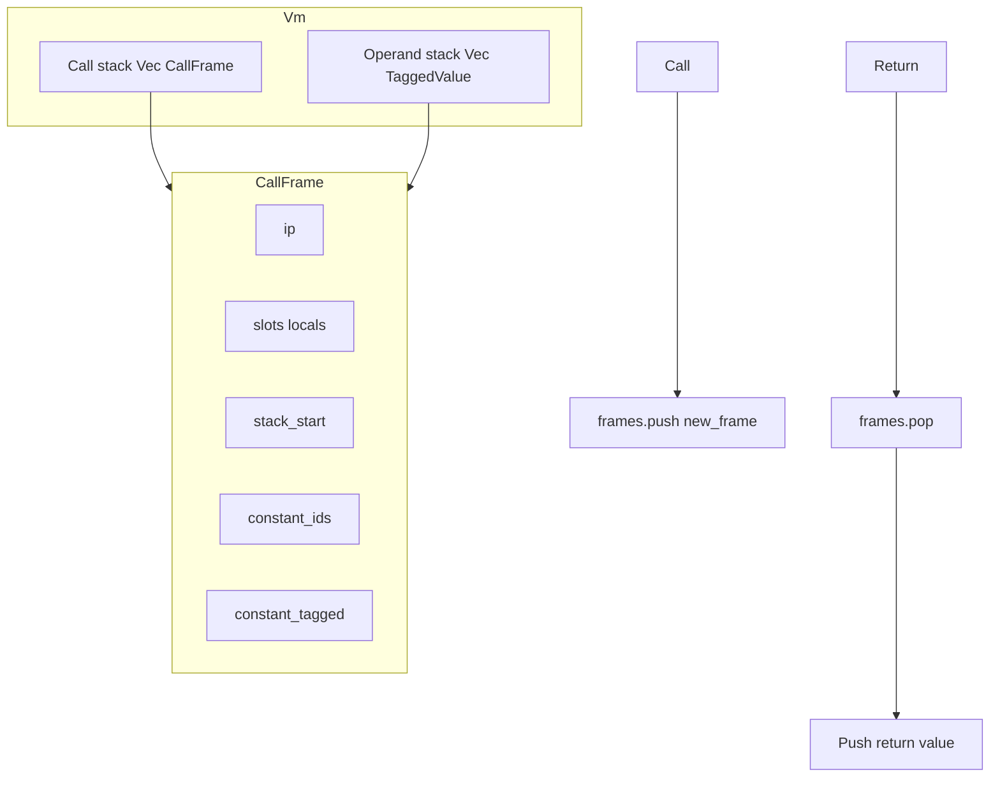

# Execution Model

This document describes the internal execution model: operand stack, call frames, slots, constants, call/return, and exception handling.

**Source:** [src/vm/stack.rs](../../../src/vm/stack.rs), [src/vm/frame.rs](../../../src/vm/frame.rs), [src/vm/executor.rs](../../../src/vm/executor.rs), [src/vm/exceptions.rs](../../../src/vm/exceptions.rs), [src/vm/vm.rs](../../../src/vm/vm.rs).

---

## Operand stack

The VM maintains a single **operand stack**: `Vec<TaggedValue>` on `Vm`. All active frames share this stack. Values are either:

- **Immediates** (TaggedValue for number, bool, null): no heap lookup in the hot path.
- **Heap references** (TaggedValue from ValueId): refer to `value_store` or, for heavy values, `heavy_store`.

**Stack operations** ([src/vm/stack.rs](../../../src/vm/stack.rs)):

- `push(stack, tv)` — push a TaggedValue.
- `push_id(stack, id)` — push a heap reference (TaggedValue::from_heap(id)).
- `pop(stack, frames, exception_handlers, value_store, heavy_store)` — pop one value; enforces that stack length stays above the current frame’s `stack_start` (stack underflow otherwise triggers exception handling).

Each **CallFrame** has a **stack_start** index. The region `stack[stack_start ..]` is the operands belonging to that frame. When a function is called, arguments are already on the stack; the new frame’s `stack_start` is set so that its parameters (and later temporaries) live above it. On return, the callee’s stack region is effectively replaced by the return value.

---

## Call frames

A **CallFrame** represents one function activation:

- **function** — The bytecode function (chunk, arity, name, etc.).
- **ip** — Instruction pointer into `function.chunk.code`.
- **slots** — Local variables (including parameters) as `Vec<TaggedValue>`. LoadLocal(slot) / StoreLocal(slot) index into this.
- **stack_start** — Base index in the VM stack for this frame’s operands.
- **constant_ids** — Chunk constants materialized into value_store when the frame was created.
- **constant_tagged** — For each constant, an optional TaggedValue for immediates (Number/Bool/Null) so that Constant(idx) can push without a store lookup.

Frames are created by **CallFrame::new(function, stack_start, store, heap)** (or `new_with_cache`). Constants are loaded into the store and optionally cached as tagged immediates. **module_name** is copied from `function.module_name` and used by LoadGlobal/StoreGlobal to choose between module namespace and VM unified globals.

---

## Constants and heavy values

- **Constants**: At frame creation, each element of `function.chunk.constants` is stored via `store_value` into value_store (and heavy_store if needed). The resulting ValueIds are in `frame.constant_ids`. For immediates, `constant_tagged[i]` is `Some(TaggedValue)` so the executor can push directly. **Constant(usize)** pushes either `constant_tagged[idx].unwrap()` or the value loaded from `constant_ids[idx]`.
- **Heavy values**: Types like Table live in **HeavyStore**; ValueCell holds `Heavy(index)`. Load/store convert between TaggedValue and store IDs as needed (see [src/vm/store_convert.rs](../../../src/vm/store_convert.rs)).

---

## Call and return

**Call (OpCode::Call(arity) / CallWithUnpack(arity)):**

1. The callee is on the stack (user function as ValueCell::Function, or Value::ModuleFunction, or native). Arguments are the top `arity` values (or one object for CallWithUnpack).
2. Executor resolves the callee to a `Function` (or native). For a user/Module function it creates a **new CallFrame** with:
   - the function’s chunk,
   - `stack_start` = current stack length minus the arguments (so the new frame “owns” the argument region),
   - slots filled from the popped arguments.
3. **frames.push(new_frame)**. Execution continues in the new frame; IP starts at 0.

**Return (OpCode::Return):**

1. The return value is on the stack (or null if none).
2. Executor pops the current frame (**frames.pop()**), then ensures the return value is on the stack (popped and re-pushed after pop so the stack is in a consistent state for the caller).
3. Returns **VMStatus::Return(return_value_id)** so the top-level loop in **run()** can exit and produce the result.

**Frame exhaustion (no explicit Return):**  
If **executor::step** sees `frame.ip >= chunk.code.len()` (e.g. empty function body), it **pops** the frame and continues with the caller; it does not push a return value (the caller may expect one — semantics depend on the compiler ensuring a Return at the end of non-void paths).

---

## Exception handling

**ExceptionHandler** ([src/vm/exceptions.rs](../../../src/vm/exceptions.rs)) records catch/finally IPs and stack height for a try block. When a runtime error occurs:

- **ExceptionHandler::handle_exception** is called with the current stack, frames, and error.
- It matches the current IP against registered handlers (catch/finally). It may **pop one or more frames** (e.g. `vm_frames.pop()`) while unwinding to the handler’s frame, then set IP to the catch/finally and continue.

Stack traces are built from **ExceptionHandler::build_stack_trace(frames)** (function name, line, file per frame).

---

## Summary diagram

- **run()** pushes the initial frame (main chunk), then loop: **step()** → **execute_instruction()**.
- **step()** pops a frame when `ip >= code.len()`; **execute_instruction()** pushes a frame on Call/CallWithUnpack and pops on Return, returning VMStatus so **run()** can either continue or yield the final value.
