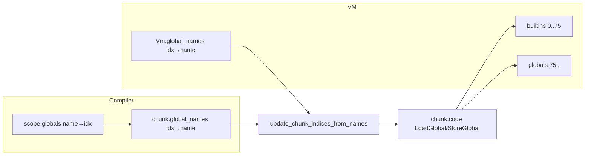

# Globals and Namespace

This document describes the global variable mechanism and name-based index remapping (namespace) used by the VM and compiler.

**Source:** [src/vm/global_slot.rs](../../../src/vm/global_slot.rs), [src/vm/globals.rs](../../../src/vm/globals.rs), [src/vm/vm.rs](../../../src/vm/vm.rs) (`update_chunk_indices_from_names`), [src/compiler/scope.rs](../../../src/compiler/scope.rs), [src/compiler/variable/resolver.rs](../../../src/compiler/variable/resolver.rs), [src/compiler/expr/variable.rs](../../../src/compiler/expr/variable.rs).

---

## GlobalSlot

A **GlobalSlot** ([src/vm/global_slot.rs](../../../src/vm/global_slot.rs)) holds one global value in one of two forms:

| Variant | Meaning |
|---------|---------|
| **Inline(TaggedValue)** | Primitive (number, bool, null) stored directly; avoids value_store allocate/get in hot path. |
| **Heap(ValueId)** | Reference into value_store (or heavy_store via ValueCell::Heavy). |

**resolve_to_value_id(&mut self, store)** — For reads: if Inline, materializes once into the store and upgrades the slot to Heap(id) so future reads use the same id; if Heap, returns the id. This keeps semantics consistent while allowing one-time promotion of immediates to the heap when needed (e.g. for export or store APIs).

**default_global_slot()** / **GlobalSlot::null()** — Initial state for unused slots (null in store semantics).

---

## VM layout: builtins vs globals

- **builtins** — `Vec<GlobalSlot>` for indices **0..BUILTIN_END** (75). These are the built-in functions and names (print, len, range, table, …). Shared by all modules. Registered at VM creation via **globals::register_native_globals** (see [src/vm/globals.rs](../../../src/vm/globals.rs) and **BUILTIN_GLOBAL_NAMES**).
- **globals** — `Vec<GlobalSlot>` for indices **>= BUILTIN_END**. Used for script/module globals (including __main__, argv, user variables). When a frame has **module_name** set, LoadGlobal/StoreGlobal for indices >= BUILTIN_END may resolve against that module’s **ModuleObject** (its own globals and namespace); otherwise the VM’s unified **globals** (and builtins for index < 75) are used.

So “namespace” at runtime is: (1) which global array to use (VM builtins + VM globals vs module’s globals + builtins), and (2) the mapping **index → name** used for remapping bytecode indices by name.

---

## global_names and explicit_global_names

- **global_names** — `BTreeMap<usize, String>`: global slot index → name. Stored on the VM and on each Chunk. Used so that after merging (e.g. after Import/ImportFrom), bytecode can be **patched by name**: chunk has LoadGlobal(72) with name "config"; VM has "config" at 79; we rewrite 72 → 79 in the chunk.
- **explicit_global_names** — Same structure for variables declared with the **global** keyword. Merge and remap logic respects both.

The compiler keeps **chunk.global_names** in sync whenever it emits LoadGlobal(idx) or StoreGlobal(idx): it inserts **chunk.global_names.insert(idx, name)** so the VM can resolve by name during **update_chunk_indices_from_names**.

---

## merge_global_names

**globals::merge_global_names** ([src/vm/globals.rs](../../../src/vm/globals.rs)) merges a chunk’s **global_names** and **explicit_global_names** into the VM’s maps. It:

- Does **not** overwrite builtin indices 0..74 with a different name (would break print, len, etc.).
- Does **not** overwrite existing entries with a different name, and does not insert a name that already exists at another index (avoids duplicate or wrong mapping).
- Only considers chunk indices < BUILTIN_END (75) for merging; high indices are left to the VM (already assigned by ensure_globals_from_chunk).

Called at the start of **run()** so the main chunk’s names are merged before execution.

---

## update_chunk_indices_from_names

**Vm::update_chunk_indices_from_names** ([src/vm/vm.rs](../../../src/vm/vm.rs)) rewrites **LoadGlobal** and **StoreGlobal** indices in a chunk so they match the current VM **global_names** (and optional argv override). Used:

1. After the main chunk is merged: **update_chunk_indices(&mut chunk)** (which calls update_chunk_indices_from_names with VM’s global_names and globals).
2. After **Import** / **ImportFrom** in the executor: so that the current chunk’s LoadGlobal/StoreGlobal refer to the merged layout (caller’s globals + imported names).

**Behavior:**

- **Phase 1 — Build mapping:** For each (old_idx, name) in **chunk.global_names**, find the “real” index in the VM’s **global_names** by name (deterministic: e.g. min index when multiple). Special cases:
  - **argv:** If **argv_slot_index** is set, always map "argv" to that slot so ImportFrom does not remap it to another symbol (e.g. load_settings).
  - **Sentinel for undefined:** Compiler emits **LoadGlobal(usize::MAX)** with the name in chunk.global_names for unresolved names; update_chunk_indices_from_names resolves this by name so that after ImportFrom the merged code sees the correct slot.
  - **model_config class load:** A sentinel index (MODEL_CONFIG_CLASS_LOAD_INDEX) is resolved by name to the class object slot for Settings subclass constructors.
- **Phase 2 — Patch bytecode:** Single pass over chunk.code; replace LoadGlobal(idx) / StoreGlobal(idx) with LoadGlobal(real) / StoreGlobal(real) when old_to_real contains idx.
- **Phase 3 — Update chunk.global_names:** Remove old indices, insert (real_idx, name) for each mapping (with care not to overwrite existing names at real_idx when that would be wrong).

When **globals** and **store/heap** are provided, the function can prefer a slot that is non-null (or for constructor names, a slot holding a Function) when several indices share the same name.

---

## Compiler side

- **ScopeManager** ([src/compiler/scope.rs](../../../src/compiler/scope.rs)): **locals** — stack of scopes (name → local slot); **globals** — name → global index. **declare_local** allocates the next local index; **resolve_local** searches scopes innermost to outermost; globals are resolved via **scope.globals.get(name)**.
- **Variable resolution** ([src/compiler/variable/resolver.rs](../../../src/compiler/variable/resolver.rs), [src/compiler/expr/variable.rs](../../../src/compiler/expr/variable.rs)): **resolve_and_load** / **resolve_and_store** use **resolve_local** first; if not found, use **scope.globals** and emit **LoadGlobal(idx)** / **StoreGlobal(idx)**, and ensure **chunk.global_names.insert(idx, name)**. For undefined names the compiler may emit **LoadGlobal(usize::MAX)** with the name stored in chunk.global_names so the VM can patch it later by name (e.g. after ImportFrom).
- **Explicit globals:** Declarations with **global** also update **chunk.explicit_global_names**.

So the “namespace” on the compiler side is: **scope.globals** (name → index) plus **chunk.global_names** (index → name). The VM never uses scope; it only uses chunk.global_names and its own global_names for remapping.

---

## Summary diagram

- Compiler emits (index, name) in chunk; VM assigns (slot, name) and **patches** bytecode so index → slot; executor uses the patched indices for load/store.
