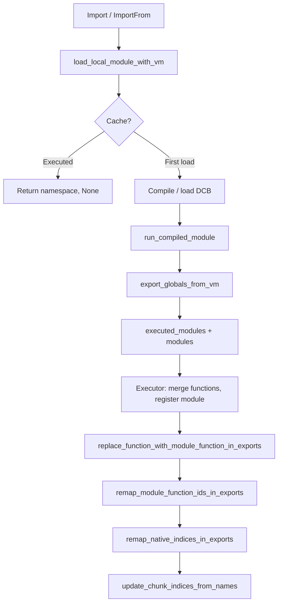

# Module Import System

This document describes how module import is compiled and executed: bytecode emission, runtime resolution, module objects, and remapping of function indices after merge.

**Source:** [src/compiler/stmt/import.rs](../../../src/compiler/stmt/import.rs), [src/vm/file_import.rs](../../../src/vm/file_import.rs), [src/vm/module_object.rs](../../../src/vm/module_object.rs), [src/vm/executor.rs](../../../src/vm/executor.rs) (Import/ImportFrom), [src/lib.rs](../../../src/lib.rs) (remap functions).

---

## Compilation

**Import statements** are compiled in [src/compiler/stmt/import.rs](../../../src/compiler/stmt/import.rs).

### `import A, B`

- For each module name: push the module name as a string constant, emit **OpCode::Import(module_index)**.
- Register the module name in **scope.globals** and **chunk.global_names** so later uses of the name (e.g. `A.foo`) resolve to the same global index.

### `from M import X, Y as Z, *`

- Build an array constant of import items: for each item, a string `"name"` or `"name:alias"` or `"*"`.
- Push module name constant and **OpCode::ImportFrom(module_index, items_index)**.
- Register the module name in scope and chunk.global_names.
- For each bound name (from Named/Aliased), insert into **ctx.imported_symbols** (name → module), assign a global index (sorted for determinism), and add to scope.globals and chunk.global_names. The compiler does **not** resolve module paths; resolution happens at runtime.

---

## Runtime resolution (file_import)

**try_find_module_in(module_name, root)** ([src/vm/file_import.rs](../../../src/vm/file_import.rs)):

- Prefer **package**: `<root>/<module_name>/__lib__.dc` (directory with `__lib__.dc`). So `core.config` is resolved as package `core` then package `config` inside it, i.e. `core/config/__lib__.dc`.
- Else **file**: `<root>/<module_name>.dc`.

Search order: **base_path** (set from the running script or from the importing module’s directory), then **DPM package paths** (get_dpm_package_paths()).

**load_local_module_with_vm(module_name, base_path, vm)**:

1. Resolve path via try_find_module_in (or for dotted names like `core.config`, walk segments with **load_local_module_dotted_with_vm**).
2. **Cache key** = canonical path of the resolved file (or __lib__.dc).
3. **Already executed this run:** If **executed_modules** contains the cache key and we have stored functions for it, return the saved namespace object and **None** (no VM). Caller must not merge again.
4. **First load:** Read source, get source mtime. Check **module_cache** for compiled (chunk + functions); else try **DCB** load; else compile via **compile_module**, store in cache and optionally save DCB. Then **run_compiled_module** in a fresh VM with base_path set to the module directory (so nested imports resolve relative to the module). **export_globals_from_vm** builds the namespace (name → Value). Store (namespace object, module functions) in **executed_modules** and **executed_module_functions**. Register **ModuleObject::from_namespace(name, namespace_rc)** in **vm.modules**.
5. Return **(module_object, Some(module_vm))** so the executor can merge functions and remap.

**run_compiled_module**: Creates a new Vm, sets base_path, ensures globals from chunk, registers natives and builtin modules, runs the chunk (no argv). The resulting VM holds the module’s globals; **export_globals_from_vm** turns them into a HashMap (name → Value) for the namespace object.

---

## ModuleObject

**ModuleObject** ([src/vm/module_object.rs](../../../src/vm/module_object.rs)):

- **name** — Module name (e.g. `"ml"`, `"core.config"`).
- **globals** — Module’s own global slots (indices 0..len correspond to bytecode indices BUILTIN_END, BUILTIN_END+1, …).
- **global_names** — Bytecode global index (≥ BUILTIN_END) → name.
- **namespace** — `Option<Rc<RefCell<HashMap<String, Value>>>>`. For a .dc module this is the export map (name → Value). Used for “from X import a” (lookup by name) and for LoadGlobal/StoreGlobal when the current frame’s **module_name** is set.

**get_export(name)** / **set_export(name, value)** — Get/set by name in namespace. **ensure_slot(index)** / **get_slot(index)** / **get_slot_mut(index)** — Access by bytecode global index (≥ BUILTIN_END).

When the executor runs code that belongs to a module (frame.module_name = Some(...)), LoadGlobal/StoreGlobal use that module’s ModuleObject (and builtins) instead of the VM’s unified globals.

---

## Executor: Import / ImportFrom

**OpCode::Import(module_index):**

- Load module name from constants, call **file_import::load_local_module_with_vm**.
- Store the module object in the global slot that the compiler assigned for the module name (so `import ml` puts the object in the “ml” slot).
- If **Some(module_vm)** returned: merge module’s functions into the caller VM, register module in **module_registry**, convert **Value::Function(local_index)** to **Value::ModuleFunction { module_id, local_index }** in the namespace via **replace_function_with_module_function_in_exports**. If the module had submodules, **remap_module_function_ids_in_exports** so submodule IDs refer to the caller’s module_registry. If the module added natives, **remap_native_indices_in_exports**. Then **update_chunk_indices_from_names** on the current chunk so LoadGlobal/StoreGlobal use the merged global layout.

**OpCode::ImportFrom(module_index, items_index):**

- Load module (same as Import); get namespace object.
- For each item in the items array: resolve name (and alias), get value from namespace, assign to a global slot (new or existing by name), update **global_names**. If the value is a class (has __class_name), also merge constructors (Value::Function → new function index in caller). Convert functions in the namespace to ModuleFunction and remap submodule/native indices as for Import.
- Call **update_chunk_indices_from_names** so the current chunk’s global indices match the merged names (e.g. so “get_settings” loads from the correct slot after import).

---

## Remap functions (lib.rs)

After merging a module, exported values may contain **Value::Function(local_index)** (valid only in the module VM). The executor converts these to **Value::ModuleFunction { module_id, local_index }** so that at call time the VM resolves the real function index via **module_registry** (get_module_function_index).

- **replace_function_with_module_function_in_exports(exports, module_id)** — Replaces every Value::Function(local_index) in the export map (and nested objects) with Value::ModuleFunction { module_id, local_index }.
- **remap_module_function_ids_in_exports(exports, old_to_new)** — When the loaded module had submodules, class objects etc. may carry ModuleFunction(old_module_id, local_index). The caller merged submodules first and got new module_ids. This function rewrites module_id in exports so old_module_id → new_module_id and get_module_function_index resolves in the caller.
- **remap_native_indices_in_exports(exports, native_start)** — Module may have added natives (index ≥ 75). After the caller appends them, NativeFunction(i) in exports must become NativeFunction(native_start + (i - 75)). This function updates all such references in the export map.

---

## Flow summary

- Compiler emits Import(module_index) or ImportFrom(module_index, items_index) and registers names in scope and chunk.global_names.
- At runtime, file_import resolves the path (package __lib__.dc or .dc file), compiles or loads from cache/DCB, runs once, exports globals to a namespace object, and stores it. Executor merges functions, converts Function → ModuleFunction, remaps module and native indices, then patches the current chunk’s LoadGlobal/StoreGlobal by name.
