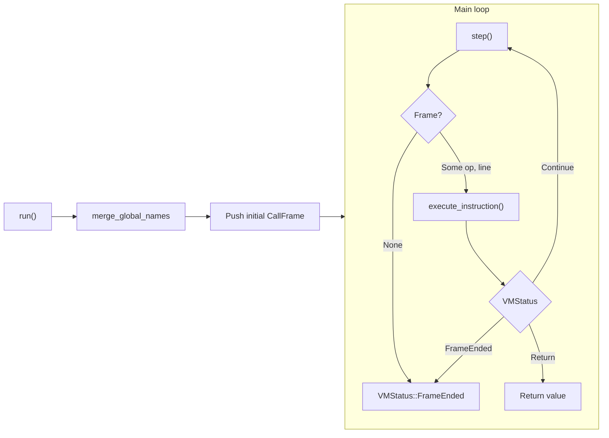

# VM Architecture

This document describes the DataCode virtual machine: main types, bytecode format, and the execution loop.

**Source:** [src/vm/vm.rs](../../../src/vm/vm.rs), [src/vm/executor.rs](../../../src/vm/executor.rs), [src/vm/frame.rs](../../../src/vm/frame.rs), [src/bytecode/opcode.rs](../../../src/bytecode/opcode.rs), [src/bytecode/chunk.rs](../../../src/bytecode/chunk.rs), [src/vm/dcb.rs](../../../src/vm/dcb.rs).

---

## Overview

The VM executes compiled bytecode. The compiler produces a main **Chunk** (top-level script) and a list of **Function**s; each function has its own Chunk. The VM holds a **stack** of operands, a **call stack** of **CallFrame**s, **builtins** and **globals**, **functions**, **natives**, and shared **value_store** / **heavy_store**. Execution is a loop: **run()** sets up the initial frame, then repeatedly **step()** (fetch next instruction) and **execute_instruction()** (dispatch by OpCode) until the main frame ends or an error occurs.

---

## Main types

### Vm ([src/vm/vm.rs](../../../src/vm/vm.rs))

Central VM struct. Key fields:

| Field | Role |
|-------|------|
| `stack` | Operand stack: `Vec<TaggedValue>` (immediates and heap refs). |
| `frames` | Call stack: `Vec<CallFrame>`. Active frame is `frames.last_mut()`. |
| `builtins` | Builtin globals for indices `0..BUILTIN_END` (75): print, len, range, table, etc. |
| `globals` | Module/unified globals for indices `>= BUILTIN_END`. |
| `functions` | All user (and merged module) functions; `Call(arity)` uses function index. |
| `natives` | Native function pointers; builtins are the first 75. |
| `value_store` | Heap for ValueCell (Number, Bool, String, Array, Object, Function, etc.). |
| `heavy_store` | Heavy values (Table, etc.) referenced via `ValueCell::Heavy(idx)`. |
| `global_names` | Map global slot index → name; used for name-based remap (e.g. after import). |
| `explicit_global_names` | Same for variables declared with `global` keyword. |
| `module_cache` | Compiled modules by path (Chunk + functions). |
| `executed_modules` | Module path → saved namespace; re-import returns without re-running. |
| `modules` | Loaded modules by name: `HashMap<String, Rc<RefCell<ModuleObject>>>`. |
| `module_registry` | Merged module info; resolves `Value::ModuleFunction { module_id, local_index }`. |
| `argv_slot_index` | When set, `update_chunk_indices_from_names` forces `"argv"` to this slot. |

Entry point to run compiled code: **`run(&mut self, chunk, argv_patch)`**. It merges chunk `global_names` via `globals::merge_global_names`, builds the initial `CallFrame` from the main chunk, pushes it, then runs the loop calling `step()` and `execute_instruction()` until `VMStatus::FrameEnded` or `VMStatus::Return(id)`.

### CallFrame ([src/vm/frame.rs](../../../src/vm/frame.rs))

One activation record. Created with **`CallFrame::new(function, stack_start, store, heap)`**.

| Field | Role |
|-------|------|
| `function` | The `Function` (name, chunk, arity, param_names, etc.). |
| `ip` | Instruction pointer into `function.chunk.code`. |
| `slots` | Local variables: `Vec<TaggedValue>`. |
| `stack_start` | Index in VM stack where this frame’s operands start. |
| `constant_ids` | Chunk constants loaded into value_store at frame creation. |
| `constant_tagged` | Optional TaggedValue for immediates (avoids store lookup on Constant). |
| `for_range_stack` | State for nested `for i in range(...)` loops. |
| `module_name` | If set, LoadGlobal/StoreGlobal use this module’s namespace; else VM unified globals. |
| Inline caches | add/sub/mul/div, GetArrayElement, Call, LoadLocal (for hot-path optimization). |

When `frame.ip >= chunk.code.len()`, the frame is exhausted; **executor::step** pops it and continues with the caller.

### Executor ([src/vm/executor.rs](../../../src/vm/executor.rs))

- **`step(frames)`**: Gets `frames.last_mut()`; if `ip >= code.len()`, pops frame and loops; otherwise reads `code[ip]`, increments `ip`, returns `Some((instruction, line))`. Returns `None` when no frame left.
- **`execute_instruction(...)`**: Large `match` on `OpCode`. Takes mutable refs to VM state (stack, frames, globals, store, etc.) and optional `vm_ptr` for module loading. Pushes new frames for **Call** / **CallWithUnpack** (user function, ModuleFunction, or native); on **Return**, pops frame and pushes return value, returns `VMStatus::Return(id)`.

---

## Bytecode

### OpCode ([src/bytecode/opcode.rs](../../../src/bytecode/opcode.rs))

Instructions include:

- **Constants / locals / globals:** `Constant(usize)`, `LoadLocal(usize)`, `StoreLocal(usize)`, `LoadGlobal(usize)`, `StoreGlobal(usize)`.
- **Arithmetic / logic:** Add, Sub, Mul, Div, IntDiv, Mod, Pow, Negate, Not, Or, And.
- **Comparison:** Equal, Greater, Less, NotEqual, GreaterEqual, LessEqual, In.
- **Control flow:** JumpLabel, JumpIfFalseLabel; ForRange/ForRangeNext/PopForRange; Jump8/16/32, JumpIfFalse8/16/32.
- **Calls:** `Call(usize)`, `CallWithUnpack(usize)`, Return.
- **Arrays / objects:** MakeArray, MakeArrayDynamic, GetArrayLength, GetArrayElement, SetArrayElement, TableFilter, Clone; MakeTuple; MakeObject, UnpackObject, MakeObjectDynamic.
- **Exceptions:** BeginTry, EndTry, Catch, EndCatch, Throw, PopExceptionHandler.
- **Stack:** Pop, Dup.
- **Modules:** `Import(usize)`, `ImportFrom(usize, usize)`.
- **Register (future):** RegAdd.

`OpCode::variant_name()` returns a stable name per variant (e.g. `MakeArray(8)` → `"MakeArray"`) for profiling.

### Chunk ([src/bytecode/chunk.rs](../../../src/bytecode/chunk.rs))

Container for one compilation unit (main script or function body):

- `code: Vec<OpCode>` — instruction stream.
- `constants: Vec<Value>` — constants referenced by `Constant(idx)`.
- `lines: Vec<usize>` — source line per instruction.
- `global_names: BTreeMap<usize, String>` — index → name for globals (used by VM for remap).
- `explicit_global_names` — same for `global`-declared variables.
- `exception_handlers`, `error_type_table` — for try/catch.

Compiler writes via `write_with_line(opcode, line)` and `add_constant(value)`.

### DCB ([src/vm/dcb.rs](../../../src/vm/dcb.rs)) — disk bytecode cache

- **DcbHeader**: magic, compiler_version, source_mtime, source_hash (SHA-256), format_version. Used to invalidate cache when source or format changes.
- **Body**: Serialized Chunk + `Vec<Function>` using **DcbConstant** for constants (Number, Bool, String, Null, FunctionIndex, Array). **SerOpCode** mirrors OpCode for serialization.
- Cache path and load/save logic allow skipping recompilation when the source file is unchanged.

---

## Execution loop (summary)

1. **run(chunk, argv_patch)**  
   Set RunContext, merge chunk `global_names` into VM, optionally patch argv LoadGlobal. Create initial `CallFrame` from main chunk, push it. If profile feature is on, call `profile::set()`.

2. **Loop**  
   - **step(&mut frames)**  
     If no frame → return `VMStatus::FrameEnded`. Else if `frame.ip >= code.len()` → pop frame, continue. Else read instruction at `frame.ip`, increment `frame.ip`, return `Some((op, line))`.  
   - **execute_instruction(op, line, ...)**  
     Match on OpCode; manipulate stack, slots, globals, store; on Call/CallWithUnpack push new frame; on Return pop frame and push return value, return `VMStatus::Return(id)`.

3. When loop exits with `VMStatus::Return(id)`, the result is the value on stack; if profile is on, `profile::take()` and `print_stats()`.

See [Execution Model](execution_model.md) for stack layout, call/return, and exception handling in more detail.
