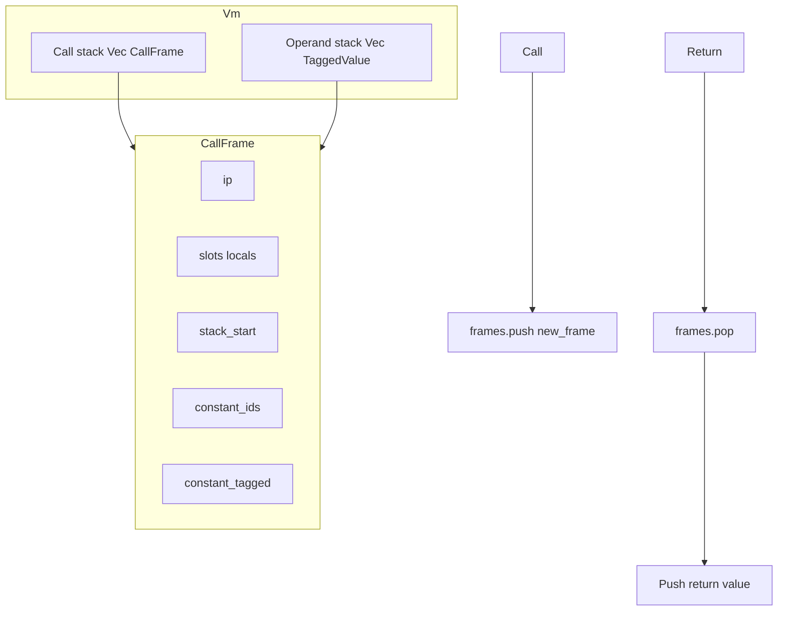

# Модель выполнения

В документе описана внутренняя модель выполнения: стек операндов, фреймы вызовов, слоты, константы, вызов/возврат и обработка исключений.

**Исходники:** [src/vm/stack.rs](../../../src/vm/stack.rs), [src/vm/frame.rs](../../../src/vm/frame.rs), [src/vm/executor.rs](../../../src/vm/executor.rs), [src/vm/exceptions.rs](../../../src/vm/exceptions.rs), [src/vm/vm.rs](../../../src/vm/vm.rs).

---

## Стек операндов

VM поддерживает единый **стек операндов**: `Vec<TaggedValue>` в `Vm`. Все активные фреймы используют этот стек. Значения бывают:

- **Immediates** (TaggedValue для number, bool, null): без обращения к heap в горячем пути.
- **Ссылки в heap** (TaggedValue из ValueId): ссылаются на `value_store` или, для тяжёлых значений, на `heavy_store`.

**Операции со стеком** ([src/vm/stack.rs](../../../src/vm/stack.rs)):

- `push(stack, tv)` — положить TaggedValue.
- `push_id(stack, id)` — положить ссылку в heap (TaggedValue::from_heap(id)).
- `pop(stack, frames, exception_handlers, value_store, heavy_store)` — снять одно значение; проверяется, что длина стека не опускается ниже `stack_start` текущего фрейма (иначе срабатывает обработка исключений).

У каждого **CallFrame** есть индекс **stack_start**. Область `stack[stack_start ..]` — операнды этого фрейма. При вызове функции аргументы уже на стеке; у нового фрейма `stack_start` задаётся так, чтобы его параметры (и временные) лежали выше. При возврате область калла фактически заменяется возвращаемым значением.

---

## Фреймы вызовов

**CallFrame** представляет одну активацию функции:

- **function** — байткод-функция (chunk, arity, имя и т.д.).
- **ip** — указатель инструкции в `function.chunk.code`.
- **slots** — локальные переменные (включая параметры) как `Vec<TaggedValue>`. LoadLocal(slot) / StoreLocal(slot) индексируют сюда.
- **stack_start** — базовый индекс в стеке VM для операндов этого фрейма.
- **constant_ids** — константы chunk, материализованные в value_store при создании фрейма.
- **constant_tagged** — для каждой константы опциональный TaggedValue для immediates (Number/Bool/Null), чтобы Constant(idx) мог пушить без обращения к store.

Фреймы создаются через **CallFrame::new(function, stack_start, store, heap)** (или `new_with_cache`). Константы загружаются в store и при необходимости кэшируются как tagged immediates. **module_name** копируется из `function.module_name` и используется LoadGlobal/StoreGlobal для выбора между namespace модуля и объединёнными глобалами VM.

---

## Константы и тяжёлые значения

- **Константы:** При создании фрейма каждый элемент `function.chunk.constants` сохраняется через `store_value` в value_store (и при необходимости в heavy_store). Полученные ValueId лежат в `frame.constant_ids`. Для immediates в `constant_tagged[i]` хранится `Some(TaggedValue)`, чтобы исполнитель мог пушить напрямую. **Constant(usize)** пушит либо `constant_tagged[idx].unwrap()`, либо значение, загруженное из `constant_ids[idx]`.
- **Тяжёлые значения:** Типы вроде Table живут в **HeavyStore**; ValueCell хранит `Heavy(index)`. Load/store конвертируют между TaggedValue и ID в store при необходимости (см. [src/vm/store_convert.rs](../../../src/vm/store_convert.rs)).

---

## Вызов и возврат

**Call (OpCode::Call(arity) / CallWithUnpack(arity)):**

1. Вызываемый объект на стеке (пользовательская функция как ValueCell::Function, или Value::ModuleFunction, или нативная). Аргументы — верхние `arity` значений (или один объект для CallWithUnpack).
2. Executor разрешает вызываемый объект в `Function` (или нативную). Для пользовательской/модульной функции создаётся **новый CallFrame** с chunk функции, `stack_start` = текущая длина стека минус аргументы (чтобы новый фрейм «владел» областью аргументов), слоты заполняются снятыми аргументами.
3. **frames.push(new_frame)**. Выполнение продолжается в новом фрейме; IP стартует с 0.

**Return (OpCode::Return):**

1. Возвращаемое значение на стеке (или null при его отсутствии).
2. Executor снимает текущий фрейм (**frames.pop()**), затем обеспечивает наличие возвращаемого значения на стеке (снимает и снова пушит после pop, чтобы стек был в согласованном состоянии для вызывающего).
3. Возвращает **VMStatus::Return(return_value_id)**, чтобы верхний цикл в **run()** мог завершиться и выдать результат.

**Исчерпание фрейма (без явного Return):**  
Если **executor::step** видит `frame.ip >= chunk.code.len()` (напр. пустое тело функции), он **снимает** фрейм и продолжает с вызывающим; возвращаемое значение не пушится (семантика зависит от компилятора, гарантирующего Return в конце не-void путей).

---

## Обработка исключений

**ExceptionHandler** ([src/vm/exceptions.rs](../../../src/vm/exceptions.rs)) хранит IP catch/finally и высоту стека для блока try. При возникновении ошибки времени выполнения:

- Вызывается **ExceptionHandler::handle_exception** с текущим стеком, фреймами и ошибкой.
- Текущий IP сопоставляется с зарегистрированными обработчиками (catch/finally). Может выполняться **pop одного или нескольких фреймов** (напр. `vm_frames.pop()`) при раскрутке до фрейма обработчика, затем IP устанавливается на catch/finally и выполнение продолжается.

Трассы стека строятся через **ExceptionHandler::build_stack_trace(frames)** (имя функции, строка, файл для каждого фрейма).

---

## Схема (кратко)

- **run()** пушит начальный фрейм (главный chunk), затем цикл: **step()** → **execute_instruction()**.
- **step()** снимает фрейм при `ip >= code.len()`; **execute_instruction()** пушит фрейм при Call/CallWithUnpack и снимает при Return, возвращая VMStatus, чтобы **run()** мог либо продолжить, либо вернуть итоговое значение.
