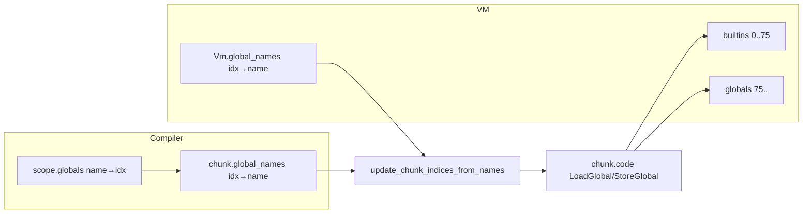

# Глобалы и namespace

В документе описан механизм глобальных переменных и перемаппинг индексов по именам (namespace) в VM и компиляторе.

**Исходники:** [src/vm/global_slot.rs](../../../src/vm/global_slot.rs), [src/vm/globals.rs](../../../src/vm/globals.rs), [src/vm/vm.rs](../../../src/vm/vm.rs) (`update_chunk_indices_from_names`), [src/compiler/scope.rs](../../../src/compiler/scope.rs), [src/compiler/variable/resolver.rs](../../../src/compiler/variable/resolver.rs), [src/compiler/expr/variable.rs](../../../src/compiler/expr/variable.rs).

---

## GlobalSlot

**GlobalSlot** ([src/vm/global_slot.rs](../../../src/vm/global_slot.rs)) хранит одно глобальное значение в одном из двух видов:

| Вариант | Значение |
|---------|----------|
| **Inline(TaggedValue)** | Примитив (number, bool, null) хранится напрямую; в горячем пути не нужны allocate/get в value_store. |
| **Heap(ValueId)** | Ссылка в value_store (или в heavy_store через ValueCell::Heavy). |

**resolve_to_value_id(&mut self, store)** — при чтении: если Inline, один раз материализует в store и переводит слот в Heap(id), чтобы последующие чтения использовали тот же id; если Heap — возвращает id. Семантика остаётся единой при одноразовом «повышении» immediates в heap при необходимости (напр. для экспорта или API store).

**default_global_slot()** / **GlobalSlot::null()** — начальное состояние для неиспользуемых слотов (null в смысле store).

---

## Расположение в VM: builtins и globals

- **builtins** — `Vec<GlobalSlot>` для индексов **0..BUILTIN_END** (75). Встроенные функции и имена (print, len, range, table и т.д.). Общие для всех модулей. Регистрируются при создании VM через **globals::register_native_globals** (см. [src/vm/globals.rs](../../../src/vm/globals.rs) и **BUILTIN_GLOBAL_NAMES**).
- **globals** — `Vec<GlobalSlot>` для индексов **>= BUILTIN_END**. Используются для глобалов скрипта/модуля (включая __main__, argv, пользовательские переменные). Если у фрейма задан **module_name**, LoadGlobal/StoreGlobal для индексов >= BUILTIN_END могут разрешаться через **ModuleObject** этого модуля (его собственные globals и namespace); иначе используются объединённые **globals** VM (и builtins для index < 75).

То есть «namespace» в рантайме — (1) какой массив глобалов использовать (builtins + globals VM или глобалы модуля + builtins), и (2) отображение **индекс → имя** для перемаппинга индексов в байткоде по имени.

---

## global_names и explicit_global_names

- **global_names** — `BTreeMap<usize, String>`: индекс глобального слота → имя. Хранится в VM и в каждом Chunk. Нужен, чтобы после слияния (напр. после Import/ImportFrom) байткод можно было **патчить по имени**: в chunk LoadGlobal(72) с именем "config"; в VM "config" на слоте 79; перезаписываем 72 → 79 в chunk.
- **explicit_global_names** — та же структура для переменных, объявленных ключевым словом **global**. Логика merge и remap учитывает оба отображения.

Компилятор поддерживает **chunk.global_names** в актуальном состоянии при каждой эмиссии LoadGlobal(idx) или StoreGlobal(idx): выполняется **chunk.global_names.insert(idx, name)**, чтобы VM мог разрешать по имени в **update_chunk_indices_from_names**.

---

## merge_global_names

**globals::merge_global_names** ([src/vm/globals.rs](../../../src/vm/globals.rs)) сливает **global_names** и **explicit_global_names** из chunk в отображения VM. Функция:

- **не** перезаписывает встроенные индексы 0..74 другим именем (иначе сломаются print, len и т.д.);
- **не** перезаписывает существующие записи другим именем и не вставляет имя, уже существующее по другому индексу (избегаем дубликатов и неверного маппинга);
- рассматривает только индексы chunk < BUILTIN_END (75); высокие индексы оставляет VM (уже назначены через ensure_globals_from_chunk).

Вызывается в начале **run()**, чтобы имена главного chunk были слиты до выполнения.

---

## update_chunk_indices_from_names

**Vm::update_chunk_indices_from_names** ([src/vm/vm.rs](../../../src/vm/vm.rs)) перезаписывает индексы **LoadGlobal** и **StoreGlobal** в chunk так, чтобы они соответствовали текущим **global_names** VM (и опциональному переопределению argv). Используется:

1. После слияния главного chunk: **update_chunk_indices(&mut chunk)** (вызывает update_chunk_indices_from_names с global_names и globals VM).
2. После **Import** / **ImportFrom** в executor: чтобы LoadGlobal/StoreGlobal текущего chunk ссылались на объединённую раскладку (глобалы вызывающего + импортированные имена).

**Поведение:**

- **Фаза 1 — Построение маппинга:** Для каждой пары (old_idx, name) в **chunk.global_names** находится «реальный» индекс в **global_names** VM по имени (детерминированно, напр. min индекс при нескольких). Особые случаи:
  - **argv:** Если задан **argv_slot_index**, имя "argv" всегда мапится на этот слот, чтобы ImportFrom не переназначил его на другой символ (напр. load_settings).
  - **Сентинел для неразрешённых:** Компилятор эмитирует **LoadGlobal(usize::MAX)** с именем в chunk.global_names для неразрешённых имён; update_chunk_indices_from_names разрешает по имени, чтобы после ImportFrom слитый код видел правильный слот.
  - **Загрузка класса model_config:** Сентинел MODEL_CONFIG_CLASS_LOAD_INDEX разрешается по имени в слот объекта класса для конструкторов подклассов Settings.
- **Фаза 2 — Патч байткода:** Один проход по chunk.code; замена LoadGlobal(idx) / StoreGlobal(idx) на LoadGlobal(real) / StoreGlobal(real), когда old_to_real содержит idx.
- **Фаза 3 — Обновление chunk.global_names:** Удаление старых индексов, вставка (real_idx, name) для каждого маппинга (с осторожностью не перезаписывать уже существующее имя по real_idx, когда это было бы неверно).

При передаче **globals** и **store/heap** функция может предпочитать слот с не-null значением (или для имён конструкторов — слот с Function), когда несколько индексов соответствуют одному имени.

---

## Сторона компилятора

- **ScopeManager** ([src/compiler/scope.rs](../../../src/compiler/scope.rs)): **locals** — стек областей (имя → локальный слот); **globals** — имя → глобальный индекс. **declare_local** выделяет следующий локальный индекс; **resolve_local** ищет по областям изнутри наружу; глобалы разрешаются через **scope.globals.get(name)**.
- **Разрешение переменных** ([src/compiler/variable/resolver.rs](../../../src/compiler/variable/resolver.rs), [src/compiler/expr/variable.rs](../../../src/compiler/expr/variable.rs)): **resolve_and_load** / **resolve_and_store** сначала используют **resolve_local**; если не найдено — **scope.globals** и эмиссия **LoadGlobal(idx)** / **StoreGlobal(idx)** с обновлением **chunk.global_names.insert(idx, name)**. Для неопределённых имён компилятор может эмитировать **LoadGlobal(usize::MAX)** с именем в chunk.global_names, чтобы VM позже пропатчил по имени (напр. после ImportFrom).
- **Явные глобалы:** Объявления с **global** также обновляют **chunk.explicit_global_names**.

То есть «namespace» на стороне компилятора — **scope.globals** (имя → индекс) плюс **chunk.global_names** (индекс → имя). VM областей не использует; только chunk.global_names и собственный global_names для remap.

---

## Схема (кратко)

Компилятор эмитирует (индекс, имя) в chunk; VM назначает (слот, имя) и **патчит** байткод так, что индекс → слот; исполнитель использует пропатченные индексы для load/store.
