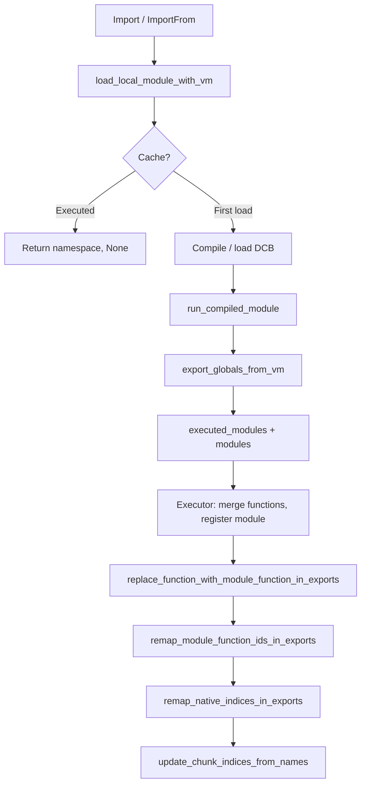

# Система импорта модулей

В документе описано, как компилируется и выполняется импорт модулей: эмиссия байткода, разрешение в рантайме, объекты модулей и перемаппинг индексов функций после merge.

**Исходники:** [src/compiler/stmt/import.rs](../../../src/compiler/stmt/import.rs), [src/vm/file_import.rs](../../../src/vm/file_import.rs), [src/vm/module_object.rs](../../../src/vm/module_object.rs), [src/vm/executor.rs](../../../src/vm/executor.rs) (Import/ImportFrom), [src/lib.rs](../../../src/lib.rs) (функции remap).

---

## Компиляция

**Операторы import** компилируются в [src/compiler/stmt/import.rs](../../../src/compiler/stmt/import.rs).

### `import A, B`

- Для каждого имени модуля: положить имя модуля строковой константой, эмитировать **OpCode::Import(module_index)**.
- Зарегистрировать имя модуля в **scope.globals** и **chunk.global_names**, чтобы последующие использования (напр. `A.foo`) разрешались в тот же глобальный индекс.

### `from M import X, Y as Z, *`

- Сформировать константу-массив элементов импорта: для каждого элемента строка `"name"` или `"name:alias"` или `"*"`.
- Положить константу имени модуля и **OpCode::ImportFrom(module_index, items_index)**.
- Зарегистрировать имя модуля в scope и chunk.global_names.
- Для каждого привязанного имени (Named/Aliased) добавить в **ctx.imported_symbols** (имя → модуль), назначить глобальный индекс (сортировка для детерминизма), добавить в scope.globals и chunk.global_names. Компилятор **не** разрешает пути к модулям; разрешение выполняется в рантайме.

---

## Разрешение в рантайме (file_import)

**try_find_module_in(module_name, root)** ([src/vm/file_import.rs](../../../src/vm/file_import.rs)):

- Предпочтение **пакету**: `<root>/<module_name>/__lib__.dc` (директория с `__lib__.dc`). Так `core.config` разрешается как пакет `core`, затем пакет `config` внутри, т.е. `core/config/__lib__.dc`.
- Иначе **файл**: `<root>/<module_name>.dc`.

Порядок поиска: **base_path** (из запускаемого скрипта или директории импортирующего модуля), затем **DPM package paths** (get_dpm_package_paths()).

**load_local_module_with_vm(module_name, base_path, vm)**:

1. Разрешить путь через try_find_module_in (для составных имён вроде `core.config` — обход сегментов через **load_local_module_dotted_with_vm**).
2. **Ключ кэша** = канонический путь к найденному файлу (или __lib__.dc).
3. **Уже выполнялся в этом run:** Если **executed_modules** содержит ключ и есть сохранённые функции — вернуть сохранённый объект namespace и **None** (без VM). Вызывающий не должен снова делать merge.
4. **Первый запуск:** Чтение исходника, mtime. Проверка **module_cache** на скомпилированный (chunk + functions); иначе попытка загрузки **DCB**; иначе компиляция через **compile_module**, сохранение в кэш и при возможности запись DCB. Затем **run_compiled_module** в новом VM с base_path, установленным в директорию модуля (вложенные импорты разрешаются относительно модуля). **export_globals_from_vm** строит namespace (имя → Value). Сохранение (объект namespace, функции модуля) в **executed_modules** и **executed_module_functions**. Регистрация **ModuleObject::from_namespace(name, namespace_rc)** в **vm.modules**.
5. Возврат **(module_object, Some(module_vm))**, чтобы executor мог слить функции и выполнить remap.

**run_compiled_module:** Создаёт новый Vm, задаёт base_path, обеспечивает глобалы из chunk, регистрирует нативные и встроенные модули, выполняет chunk (без argv). В получившемся VM лежат глобалы модуля; **export_globals_from_vm** превращает их в HashMap (имя → Value) для объекта namespace.

---

## ModuleObject

**ModuleObject** ([src/vm/module_object.rs](../../../src/vm/module_object.rs)):

- **name** — Имя модуля (напр. `"ml"`, `"core.config"`).
- **globals** — Собственные глобальные слоты модуля (индексы 0..len соответствуют байткод-индексам BUILTIN_END, BUILTIN_END+1, …).
- **global_names** — Байткод-индекс глобала (≥ BUILTIN_END) → имя.
- **namespace** — `Option<Rc<RefCell<HashMap<String, Value>>>>`. Для .dc модуля это карта экспорта (имя → Value). Используется для «from X import a» (поиск по имени) и для LoadGlobal/StoreGlobal при установленном **module_name** у текущего фрейма.

**get_export(name)** / **set_export(name, value)** — чтение/запись по имени в namespace. **ensure_slot(index)** / **get_slot(index)** / **get_slot_mut(index)** — доступ по байткод-индексу глобала (≥ BUILTIN_END).

Когда executor выполняет код, принадлежащий модулю (frame.module_name = Some(...)), LoadGlobal/StoreGlobal используют ModuleObject этого модуля (и builtins), а не объединённые глобалы VM.

---

## Executor: Import / ImportFrom

**OpCode::Import(module_index):**

- Загрузить имя модуля из констант, вызвать **file_import::load_local_module_with_vm**.
- Сохранить объект модуля в глобальный слот, назначенный компилятором для имени модуля (так `import ml` кладёт объект в слот "ml").
- Если вернулось **Some(module_vm):** слить функции модуля в VM вызывающего, зарегистрировать модуль в **module_registry**, преобразовать **Value::Function(local_index)** в **Value::ModuleFunction { module_id, local_index }** в namespace через **replace_function_with_module_function_in_exports**. Если у модуля были подмодули — **remap_module_function_ids_in_exports**, чтобы ID подмодулей указывали на module_registry вызывающего. Если модуль добавил нативные функции — **remap_native_indices_in_exports**. Затем **update_chunk_indices_from_names** по текущему chunk, чтобы LoadGlobal/StoreGlobal использовали объединённую раскладку глобалов.

**OpCode::ImportFrom(module_index, items_index):**

- Загрузить модуль (как при Import); получить объект namespace.
- Для каждого элемента в массиве items: разрешить имя (и алиас), взять значение из namespace, назначить глобальный слот (новый или существующий по имени), обновить **global_names**. Если значение — класс (есть __class_name), также слить конструкторы (Value::Function → новый индекс функции в вызывающем). Преобразовать функции в namespace в ModuleFunction и выполнить remap подмодулей/нативных индексов как при Import.
- Вызвать **update_chunk_indices_from_names**, чтобы глобальные индексы текущего chunk соответствовали слитым именам (напр. чтобы "get_settings" загружался из правильного слота после импорта).

---

## Функции remap (lib.rs)

После слияния модуля экспортированные значения могут содержать **Value::Function(local_index)** (корректно только в VM модуля). Executor преобразует их в **Value::ModuleFunction { module_id, local_index }**, чтобы при вызове VM разрешала реальный индекс функции через **module_registry** (get_module_function_index).

- **replace_function_with_module_function_in_exports(exports, module_id)** — Заменяет каждое Value::Function(local_index) в карте экспорта (и во вложенных объектах) на Value::ModuleFunction { module_id, local_index }.
- **remap_module_function_ids_in_exports(exports, old_to_new)** — Когда загруженный модуль имел подмодули, объекты классов и т.д. могут нести ModuleFunction(old_module_id, local_index). Вызывающий сначала слил подмодули и получил новые module_ids. Функция перезаписывает module_id в exports так, что old_module_id → new_module_id и get_module_function_index разрешается в контексте вызывающего.
- **remap_native_indices_in_exports(exports, native_start)** — Модуль мог добавить нативные функции (индекс ≥ 75). После добавления их вызывающим NativeFunction(i) в exports должен стать NativeFunction(native_start + (i - 75)). Функция обновляет все такие ссылки в карте экспорта.

---

## Схема потока

Компилятор эмитирует Import(module_index) или ImportFrom(module_index, items_index) и регистрирует имена в scope и chunk.global_names. В рантайме file_import разрешает путь (пакет __lib__.dc или файл .dc), компилирует или загружает из кэша/DCB, выполняет один раз, экспортирует глобалы в объект namespace и сохраняет его. Executor сливает функции, преобразует Function → ModuleFunction, выполняет remap индексов модулей и нативных функций, затем патчит LoadGlobal/StoreGlobal текущего chunk по имени.
