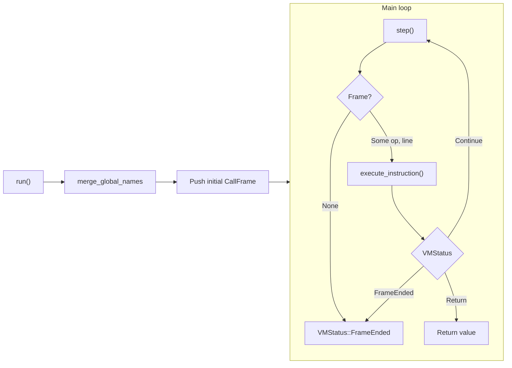

# Архитектура VM

В документе описана виртуальная машина DataCode: основные типы, формат байткода и цикл выполнения.

**Исходники:** [src/vm/vm.rs](../../../src/vm/vm.rs), [src/vm/executor.rs](../../../src/vm/executor.rs), [src/vm/frame.rs](../../../src/vm/frame.rs), [src/bytecode/opcode.rs](../../../src/bytecode/opcode.rs), [src/bytecode/chunk.rs](../../../src/bytecode/chunk.rs), [src/vm/dcb.rs](../../../src/vm/dcb.rs).

---

## Обзор

VM выполняет скомпилированный байткод. Компилятор выдаёт основной **Chunk** (топ-уровень скрипта) и список **Function**; у каждой функции свой Chunk. VM хранит **стек** операндов, **стек вызовов** из **CallFrame**, **builtins** и **globals**, **functions**, **natives**, общие **value_store** и **heavy_store**. Выполнение — цикл: **run()** создаёт начальный фрейм, затем повторяются **step()** (взять следующую инструкцию) и **execute_instruction()** (диспетчеризация по OpCode), пока основной фрейм не завершится или не произойдёт ошибка.

---

## Основные типы

### Vm ([src/vm/vm.rs](../../../src/vm/vm.rs))

Центральная структура VM. Основные поля:

| Поле | Назначение |
|------|------------|
| `stack` | Стек операндов: `Vec<TaggedValue>` (immediates и ссылки в heap). |
| `frames` | Стек вызовов: `Vec<CallFrame>`. Активный фрейм — `frames.last_mut()`. |
| `builtins` | Встроенные глобалы для индексов `0..BUILTIN_END` (75): print, len, range, table и т.д. |
| `globals` | Глобалы модуля/объединённые для индексов `>= BUILTIN_END`. |
| `functions` | Все пользовательские (и слитые из модулей) функции; `Call(arity)` использует индекс функции. |
| `natives` | Указатели на нативные функции; первые 75 — встроенные. |
| `value_store` | Heap для ValueCell (Number, Bool, String, Array, Object, Function и т.д.). |
| `heavy_store` | «Тяжёлые» значения (Table и др.), доступ через `ValueCell::Heavy(idx)`. |
| `global_names` | Отображение индекс слота глобала → имя; используется для remap по имени (напр. после импорта). |
| `explicit_global_names` | То же для переменных, объявленных ключевым словом `global`. |
| `module_cache` | Скомпилированные модули по пути (Chunk + functions). |
| `executed_modules` | Путь модуля → сохранённый namespace; повторный импорт возвращает без повторного запуска. |
| `modules` | Загруженные модули по имени: `HashMap<String, Rc<RefCell<ModuleObject>>>`. |
| `module_registry` | Информация о слитых модулях; разрешает `Value::ModuleFunction { module_id, local_index }`. |
| `argv_slot_index` | Если задан, `update_chunk_indices_from_names` принудительно мапит `"argv"` на этот слот. |

Точка входа для выполнения скомпилированного кода: **`run(&mut self, chunk, argv_patch)`**. В начале вызывается `globals::merge_global_names` для слияния `global_names` из chunk, создаётся начальный `CallFrame` по главному chunk, он пушится, затем цикл вызовов `step()` и `execute_instruction()` до `VMStatus::FrameEnded` или `VMStatus::Return(id)`.

### CallFrame ([src/vm/frame.rs](../../../src/vm/frame.rs))

Одна запись активации. Создаётся через **`CallFrame::new(function, stack_start, store, heap)`**.

| Поле | Назначение |
|------|------------|
| `function` | Функция (имя, chunk, arity, param_names и т.д.). |
| `ip` | Указатель инструкции в `function.chunk.code`. |
| `slots` | Локальные переменные: `Vec<TaggedValue>`. |
| `stack_start` | Индекс в стеке VM, с которого начинаются операнды этого фрейма. |
| `constant_ids` | Константы chunk, загруженные в value_store при создании фрейма. |
| `constant_tagged` | Опциональный TaggedValue для immediates (избегает обращения к store при Constant). |
| `for_range_stack` | Состояние вложенных циклов `for i in range(...)`. |
| `module_name` | Если задано, LoadGlobal/StoreGlobal используют namespace этого модуля; иначе объединённые глобалы VM. |
| Inline caches | add/sub/mul/div, GetArrayElement, Call, LoadLocal (оптимизация горячих путей). |

Когда `frame.ip >= chunk.code.len()`, фрейм исчерпан; **executor::step** снимает его и продолжает с вызывающим.

### Executor ([src/vm/executor.rs](../../../src/vm/executor.rs))

- **`step(frames)`**: Берёт `frames.last_mut()`; если `ip >= code.len()`, снимает фрейм и повторяет; иначе читает `code[ip]`, увеличивает `ip`, возвращает `Some((instruction, line))`. Возвращает `None`, когда фреймов не осталось.
- **`execute_instruction(...)`**: Большой `match` по `OpCode`. Принимает мутабельные ссылки на состояние VM (stack, frames, globals, store и т.д.) и опционально `vm_ptr` для загрузки модулей. Пушит новые фреймы для **Call** / **CallWithUnpack** (пользовательская функция, ModuleFunction или нативная); при **Return** снимает фрейм и пушит возвращаемое значение, возвращает `VMStatus::Return(id)`.

---

## Байткод

### OpCode ([src/bytecode/opcode.rs](../../../src/bytecode/opcode.rs))

Инструкции включают:

- **Константы / локальные / глобальные:** `Constant(usize)`, `LoadLocal(usize)`, `StoreLocal(usize)`, `LoadGlobal(usize)`, `StoreGlobal(usize)`.
- **Арифметика / логика:** Add, Sub, Mul, Div, IntDiv, Mod, Pow, Negate, Not, Or, And.
- **Сравнения:** Equal, Greater, Less, NotEqual, GreaterEqual, LessEqual, In.
- **Управление потоком:** JumpLabel, JumpIfFalseLabel; ForRange/ForRangeNext/PopForRange; Jump8/16/32, JumpIfFalse8/16/32.
- **Вызовы:** `Call(usize)`, `CallWithUnpack(usize)`, Return.
- **Массивы / объекты:** MakeArray, MakeArrayDynamic, GetArrayLength, GetArrayElement, SetArrayElement, TableFilter, Clone; MakeTuple; MakeObject, UnpackObject, MakeObjectDynamic.
- **Исключения:** BeginTry, EndTry, Catch, EndCatch, Throw, PopExceptionHandler.
- **Стек:** Pop, Dup.
- **Модули:** `Import(usize)`, `ImportFrom(usize, usize)`.
- **Регистры (на будущее):** RegAdd.

`OpCode::variant_name()` возвращает стабильное имя варианта (напр. `MakeArray(8)` → `"MakeArray"`) для профилирования.

### Chunk ([src/bytecode/chunk.rs](../../../src/bytecode/chunk.rs))

Контейнер одной единицы компиляции (главный скрипт или тело функции):

- `code: Vec<OpCode>` — поток инструкций.
- `constants: Vec<Value>` — константы, на которые ссылается `Constant(idx)`.
- `lines: Vec<usize>` — номер строки источника для каждой инструкции.
- `global_names: BTreeMap<usize, String>` — индекс → имя для глобалов (используется VM для remap).
- `explicit_global_names` — то же для переменных, объявленных через `global`.
- `exception_handlers`, `error_type_table` — для try/catch.

Компилятор пишет через `write_with_line(opcode, line)` и `add_constant(value)`.

### DCB ([src/vm/dcb.rs](../../../src/vm/dcb.rs)) — кэш байткода на диске

- **DcbHeader**: magic, compiler_version, source_mtime, source_hash (SHA-256), format_version. Нужен для инвалидации кэша при изменении источника или формата.
- **Тело**: Сериализованные Chunk + `Vec<Function>` с **DcbConstant** для констант (Number, Bool, String, Null, FunctionIndex, Array). **SerOpCode** повторяет OpCode для сериализации.
- Путь кэша и логика load/save позволяют пропускать перекомпиляцию при неизменном исходном файле.

---

## Цикл выполнения (кратко)

1. **run(chunk, argv_patch)**  
   Устанавливается RunContext, в VM сливаются `global_names` из chunk, при необходимости патчится LoadGlobal для argv. Создаётся начальный `CallFrame` по главному chunk и пушится. При включённой фиче profile вызывается `profile::set()`.

2. **Цикл**  
   - **step(&mut frames)**  
     Если фрейма нет → возврат `VMStatus::FrameEnded`. Иначе если `frame.ip >= code.len()` → снять фрейм, продолжить. Иначе прочитать инструкцию по `frame.ip`, увеличить `frame.ip`, вернуть `Some((op, line))`.  
   - **execute_instruction(op, line, ...)**  
     Match по OpCode; изменение stack, slots, globals, store; при Call/CallWithUnpack — push нового фрейма; при Return — pop фрейма и push возвращаемого значения, возврат `VMStatus::Return(id)`.

3. При выходе из цикла с `VMStatus::Return(id)` результат — значение на стеке; при включённом profile вызываются `profile::take()` и `print_stats()`.

Подробнее о стеке, вызове/возврате и обработке исключений см. [Модель выполнения](execution_model.md).
